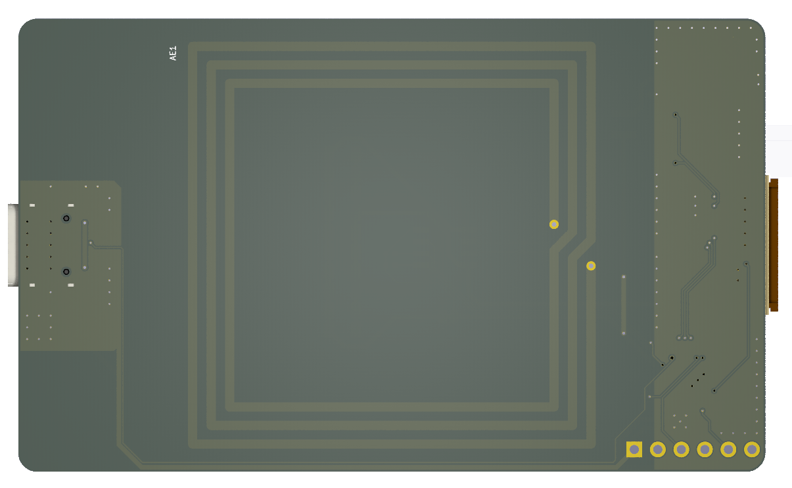

# Magic Epaper Hardware

This repo contains the Magic Epaper hardware design files. This board is
designed as a bridge to expose the ePaper display interface to NFC and USB
making [magic-epaper-app](https://github.com/fossasia/magic-epaper-firmware)
easy to control and transfer bitmap to the display. This board may be used with
any NFC reader that supports NFC-V and any compatible 24-pin FPC epaper.

## PCB Layout

**Front side**

**Back side**

## Key features

- [Energy
  harvesting](https://www.st.com/resource/en/application_note/an4913-energy-harvesting-delivery-impact-on-st25dvi2c-series-behaviour-during-rf-communication-stmicroelectronics.pdf)
  provided by [ST25DV](https://www.st.com/resource/en/datasheet/st25dv04k.pdf)
  chip and tuned antenna (battery-less).
- NFC-V (ISO15693) supported by ST25DV chip.
- Supports any compatible 24-pin FPC epaper display. Tested with
  [GDEY037Z03](https://v4.cecdn.yun300.cn/100001_1909185148/GDEY037Z03-n.pdf).
- USB low-speed connection over USB-C connector.
- Cheap RISC-V microcontroller,
  [CH32V003F4P6](https://www.wch-ic.com/products/CH32V003.html).

## Applications and Firmware Source Repositories

The following software components are available:

- Mobile app: https://github.com/fossasia/magic-epaper-app
- Firmware: https://github.com/fossasia/magic-epaper-firmware

## Part list

See [BOM](docs/bill-of-materials.csv).